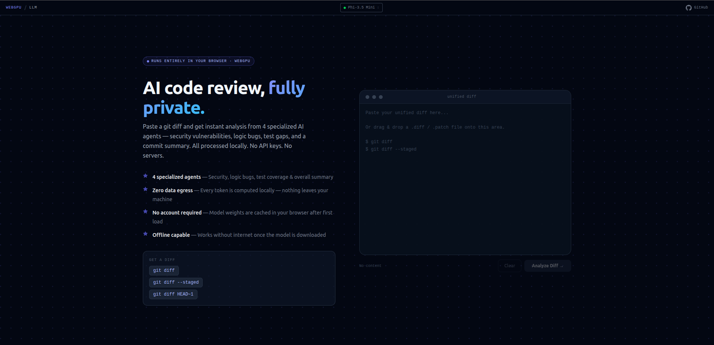

# WebGPU Local Code Reviewer

A fully client-side, multi-agent code review tool powered by [WebLLM](https://github.com/mlc-ai/web-llm). Paste a unified diff, get an AI-powered review with bug detection, security auditing, performance analysis, and risk scoring — all running locally in your browser via WebGPU.

**Zero server costs. Zero data leaves the browser.**


---

## Why This Exists

Code review is one of the highest-leverage activities in software engineering, but it's also one of the most time-consuming. Existing AI code review tools send your code to external servers — raising privacy concerns for proprietary codebases.

This tool runs a full multi-agent review pipeline entirely in-browser using WebGPU acceleration. Your code never leaves your machine.

## Features

- **Multi-Agent Pipeline** — 4 specialized AI agents analyze your code sequentially:
  - **Bug Reviewer** — logic errors, null checks, edge cases, race conditions
  - **Security Auditor** — XSS, injection, eval, hardcoded secrets, path traversal
  - **Performance Reviewer** — N+1 queries, unnecessary re-renders, memory leaks, blocking operations
  - **Summary Agent** — deduplicates findings, ranks by severity, produces a cohesive summary

- **Agent Memory** — each agent receives findings from prior agents, building cumulative context without running multiple models

- **Model Selector** — choose from 5 MLC-compiled models ranging from 1.8 GB to 4.9 GB; selection persists across sessions and can be changed mid-session without a page refresh:

  | Model | Size | Context | Notes |
  |---|---|---|---|
  | Phi-3.5 Mini | 2.2 GB | 4K | Default — fast, reliable |
  | Llama 3.2 3B | 1.8 GB | 4K | Smallest download |
  | Llama 3.1 8B | 4.9 GB | 8K | Best for large diffs |
  | Mistral 7B | 4.1 GB | 8K | Strong reasoning |
  | Qwen 2.5 Coder 7B | 4.3 GB | 8K | **Best for code review** |

- **Progressive Results** — file-by-file processing with real-time token streaming. See results as they arrive instead of waiting for the entire review to finish

- **Rich Diff Viewer** — split-pane layout with inline issue comments anchored to the exact lines where problems were found

- **Risk Scoring** — 0-10 risk score per file and overall, weighted by change size and boosted for critical security findings

- **Generated Artifacts** — conventional commit message and test suggestions produced after review

- **Review Persistence** — last review survives page refresh and can be restored without re-running inference

- **Keyboard Shortcuts** — `j`/`k` to navigate files, `r` to start review, `n` for new review, `Escape` to deselect

- **File Selection** — choose which files to include in the review; skip irrelevant changes

- **Large Diff Warning** — guardrail for diffs with 15+ files or 60+ estimated chunks

## Requirements

| Requirement | Details |
|---|---|
| Browser | Chrome 113+ or Edge 113+ (WebGPU required) |
| GPU VRAM | 3 GB minimum (for Phi-3.5 Mini); 6 GB recommended for 7–8B models |
| Disk Space | 1.8–4.9 GB depending on selected model (cached in IndexedDB after first download) |
| Node.js | 18+ (for local development only) |

> Firefox and Safari do not yet support WebGPU. On Chrome, ensure `chrome://flags/#enable-unsafe-webgpu` is enabled if WebGPU is not available by default.

## Getting Started

```bash
# Clone the repository
git clone https://github.com/AESiR-0/webgpu-llm.git
cd webgpu-llm

# Install dependencies
npm install

# Start the development server
npm run dev
```

Open [http://localhost:5173](http://localhost:5173) in Chrome or Edge.

### First Run

1. **Choose a model** — select from the model picker on the loader screen. Phi-3.5 Mini is the default (2.2 GB, fastest). Qwen 2.5 Coder produces the highest quality results (4.3 GB).
2. Click **Load Model** — model weights download and cache in IndexedDB (one-time per model)
3. Paste a unified diff (output from `git diff` or a `.diff` file from a GitHub PR)
4. Select which files to review (all are checked by default)
5. Click **Start Review** and watch the agents work

To switch models after loading, click the model name in the top navigation bar or the status bar at the bottom.

## Usage

### Getting a Diff

```bash
# Unstaged changes
git diff

# Staged changes
git diff --cached

# Between branches
git diff main..feature-branch

# From a GitHub PR (append .diff to any PR URL)
curl -L https://github.com/owner/repo/pull/123.diff > review.diff
```

Paste the output into the text area, or drag-and-drop a `.diff` / `.patch` file.

### Reading Results

The review dashboard has four tabs:

| Tab | Contents |
|---|---|
| **Summary** | Overall risk score, issue counts by severity, model stats, review duration |
| **Security** | Dedicated security findings sorted by severity (critical first) |
| **Tests** | AI-suggested test cases based on the changes |
| **Commit** | Generated conventional commit message with copy button |

Inline comments appear directly in the diff viewer for the selected file, anchored to the relevant lines.

### Keyboard Shortcuts

| Key | Action |
|---|---|
| `j` | Next file |
| `k` | Previous file |
| `r` | Start review (when idle) |
| `n` | New review (clears current) |
| `Escape` | Deselect file |

## Architecture

```
┌─────────────────────────────────────────────────────┐
│                    Browser (WebGPU)                  │
│                                                     │
│  ┌──────────┐    ┌──────────┐    ┌───────────────┐  │
│  │  Diff    │───▶│ Semantic │───▶│ Agent Pipeline │  │
│  │  Parser  │    │ Chunker  │    │               │  │
│  └──────────┘    └──────────┘    │  Bug ──────┐  │  │
│                                  │  Security ─┤  │  │
│  ┌──────────┐    ┌──────────┐    │  Perf ─────┤  │  │
│  │  Zustand │◀───│  Scoring │◀───│  Summary ──┘  │  │
│  │  Store   │    │  Engine  │    └───────────────┘  │
│  └────┬─────┘    └──────────┘                       │
│       │                                             │
│  ┌────▼──────────────────────────────────────────┐  │
│  │              React UI Layer                   │  │
│  │  ModelLoader │ DiffInput │ ReviewDashboard    │  │
│  └───────────────────────────────────────────────┘  │
└─────────────────────────────────────────────────────┘
```

### Project Structure

```
src/
├── lib/                    # Core logic (framework-agnostic)
│   ├── engine.js           # WebLLM singleton & model lifecycle
│   ├── models.js           # Model catalog (5 MLC models with metadata)
│   ├── diffParser.js       # Unified diff parsing & file filtering
│   ├── chunker.js          # Semantic chunking (500–800 tokens)
│   ├── agents.js           # 4-agent pipeline orchestration
│   ├── prompts.js          # LLM prompt templates
│   ├── parseResponse.js    # JSON extraction & sanitization from LLM output
│   ├── scoring.js          # Risk calculation (0–10)
│   ├── reviewer.js         # Top-level review orchestration
│   └── persist.js          # localStorage save/restore
├── store/
│   └── useStore.js         # Zustand store (engine, diff, review, ui slices)
├── components/
│   ├── model/              # ModelLoader, ModelSelector, ModelSwitchDialog, NoWebGPU
│   ├── input/              # Diff textarea, agent progress, warnings
│   ├── diff/               # File tree, diff viewer, inline comments
│   ├── review/             # Results tabs (summary, security, tests, commit)
│   ├── layout/             # Navbar, Header, StatusBar, SplitLayout
│   └── ui/                 # Badge, spinner, streaming text
├── hooks/
│   └── useKeyboardShortcuts.js
└── styles/
    └── diff.css            # Diff viewer theme
```

### How the Pipeline Works

1. **Parse** — `parse-diff` converts raw unified diff into structured `FileDiff` objects
2. **Chunk** — each file's hunks are split at semantic boundaries (function/class declarations) into 500–800 token chunks
3. **Review** — for each file, each chunk runs through the 4-agent pipeline sequentially:
   - Bug Agent runs first (no prior context)
   - Security Agent receives Bug Agent findings
   - Performance Agent receives Bug + Security findings
   - Summary Agent receives all three and deduplicates
4. **Score** — per-file risk calculated from `severity_weight * category_multiplier`; overall risk is a weighted average boosted for critical security findings
5. **Generate** — after all files, the model generates a conventional commit message and test suggestions

## Tech Stack

| Layer | Technology |
|---|---|
| LLM Inference | [@mlc-ai/web-llm](https://github.com/mlc-ai/web-llm) (WebGPU) |
| Supported Models | Phi-3.5-mini · Llama 3.2 3B · Llama 3.1 8B · Mistral 7B · Qwen 2.5 Coder 7B |
| Default Model | Phi-3.5-mini-instruct (q4f16, 2.2 GB, 4K context) |
| UI Framework | React 19 |
| Build Tool | Vite 7 |
| Styling | Tailwind CSS 4 |
| State Management | Zustand 5 |
| Diff Parsing | parse-diff, react-diff-view, unidiff |

## Scripts

```bash
npm run dev       # Start dev server with HMR
npm run build     # Production build → dist/
npm run preview   # Preview production build locally
npm run lint      # Run ESLint
```

## Privacy & Security

- **All inference runs locally** — no API calls, no telemetry, no server
- **Model weights** cached in IndexedDB (browser-local)
- **Last review** persisted to localStorage (clearable)
- **No cookies**, no tracking, no analytics
- The app itself is a static site that can be self-hosted anywhere

## Roadmap

| Feature | Status |
|---|---|
| Model Selector (5 models, mid-session switching) | ✅ Shipped |
| Export & Reports — Markdown, JSON, CSV download | ✅ Shipped |
| GitHub PR Integration — paste a PR URL instead of raw diff | ⏸ Deferred |
| Review History — IndexedDB-backed browsable past reviews | ⏸ Deferred |
| Prompt Customization — agent focus, toggle agents, severity filters | 🔜 Next |
| Responsive Layout — full mobile support | Planned |
| CI Integration — headless Node.js CLI + GitHub Actions | Planned |

See [`spec/FUTURE_ENHANCEMENTS.md`](./spec/FUTURE_ENHANCEMENTS.md) for detailed specs on each planned phase.

## Contributing

See [CONTRIBUTING.md](./CONTRIBUTING.md) for guidelines on setting up the development environment, code style, and submitting pull requests.

## License

MIT
